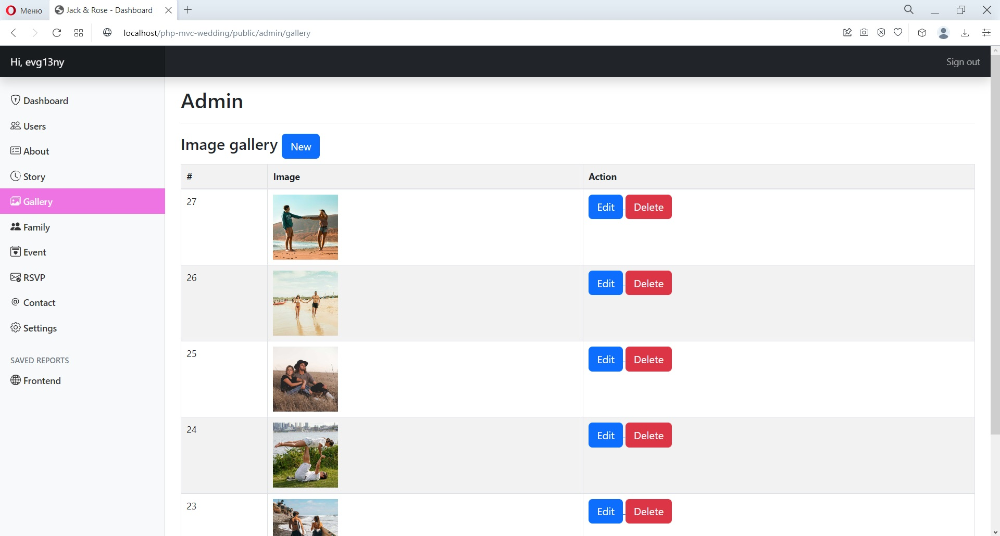
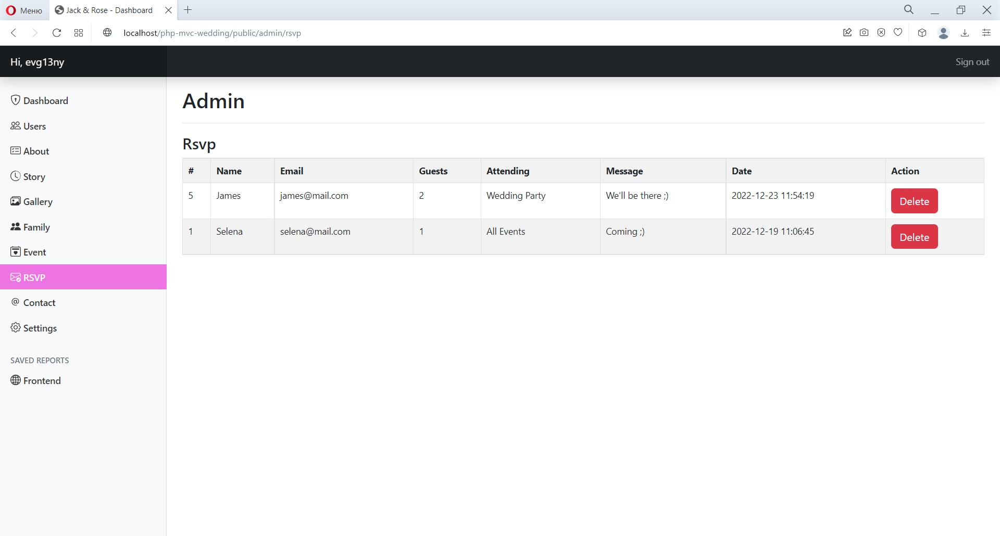

Landing page made with PHP using MVC and OOP.

Converted a <a href="https://www.free-css.com/free-css-templates/page279/jack-and-rose" target="_blank">Html example</a> into PHP site where if you have an admin rights (you can register) you can change all settings in the admin panel not at the home page in html code and also made all forms live.

